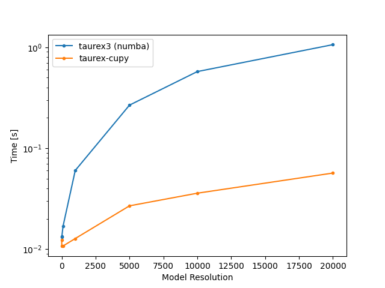

# TauREx-CuPy

TauREx-CuPy is a GPU accelerated radiative transfer plugin for [TauREx 3](https://taurex3.readthedocs.io/en/latest/) using
the [CuPy](https://cupy.dev/) as the acceleration backend.

TauREx-CuPy offers an almost 20x speedup over the CPU version of numba accelerated TauREx 3, making it ideal for large scale retrievals.

This guide covers general installation, using with the `taurex` program
and the library.
